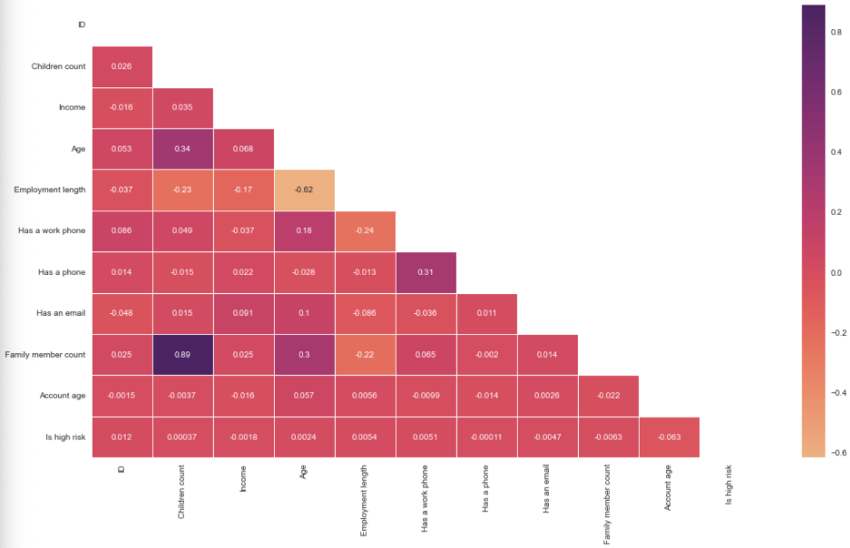
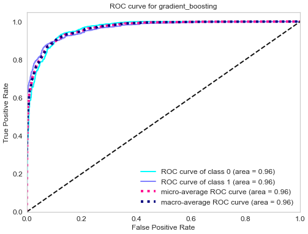

# Credit-card-approval-prediction

## Table of Contents

  - [Business problem]
  - [Data source]
  - [Methods]
  - [Tech Stack]
  - [Quick glance at the results]
  - [Lessons learned and recommendation]
  - [Limitation and what can be improved]

## Methods

- Exploratory data analysis
- Bivariate analysis
- Multivariate correlation
- S3 bucket model hosting
- Model deployment
## Tech Stack

- Python (refer to requirement.txt for the packages used in this project)
- Streamlit (interface for the model)
- AWS S3 (model storage)

## Quick glance at the results

Correlation between the features.

Confusion matrix of gradient boosting classifier.

ROC curve of gradient boosting classifier.

Top 3 models (with default parameters)

| Model     	                | Recall score 	|
|-------------------	        |------------------	|
| Support vector machine     	| 88% 	            |
| Gradient boosting    	        | 90% 	            |
| Adaboost               	    | 79% 	            |

 **Lessons learned and recommendation**

- Based on this project's analysis, income, family member headcount, and employment length are the three most predictive features in determining whether an applicant will be approved for a credit card. Other features like age and working employment status are also helpful. The least useful features are the type of dwelling and car ownership.
- The recommendation would be to focus more on the most predictive features when looking at the applicant profile and pay less attention to the least predictive features.

## Limitation and what can be improved

- Combine this model with with a regression model to predict how much of a credit limit an applicant will be approved for.
- Hyperparameter tuning with grid search or random search.
- Better interpretation of the chi-square test
- Retrain the model without the least predictive features

